# 视频安装步骤
参考视频：[2023C++名企领航班-FFmpeg与音视频编解码+OpenCV图像处理](https://www.bilibili.com/video/BV1DB4y1o7XX?spm_id_from=333.788.videopod.episodes&vd_source=4f1c34c711e7ec1d5bca2f62af5665d4)

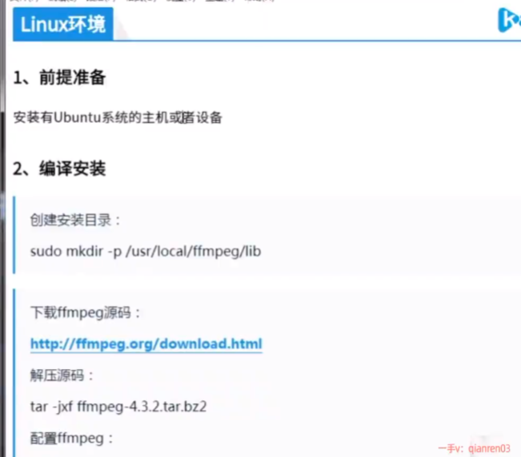

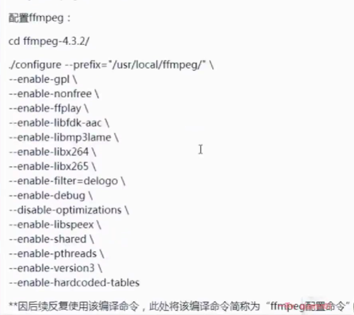


```c
./configure \                                                                                 0 (20.192s) < 14:23:34          --prefix='/usr/local/ffmpeg' \
          --enable-gpl \
          --enable-nonfree \
          --enable-ffplay \
          --enable-libfdk-aac \
          --enable-libmp3lame \
          --enable-libx264 \
          --enable-libx265 \
          --enable-filter=delogo \
          --enable-debug \
          --disable-optimizations \
          --enable-libspeex \
          --enable-shared \
          --enable-pthreads \
          --enable-version3 \
          --enable-hardcoded-tables \
          --extra-cflags="-I/usr/local/ffmpeg/include" \
          --extra-ldflags="-L/usr/local/ffmpeg/lib"
```

后面安装了很多路径

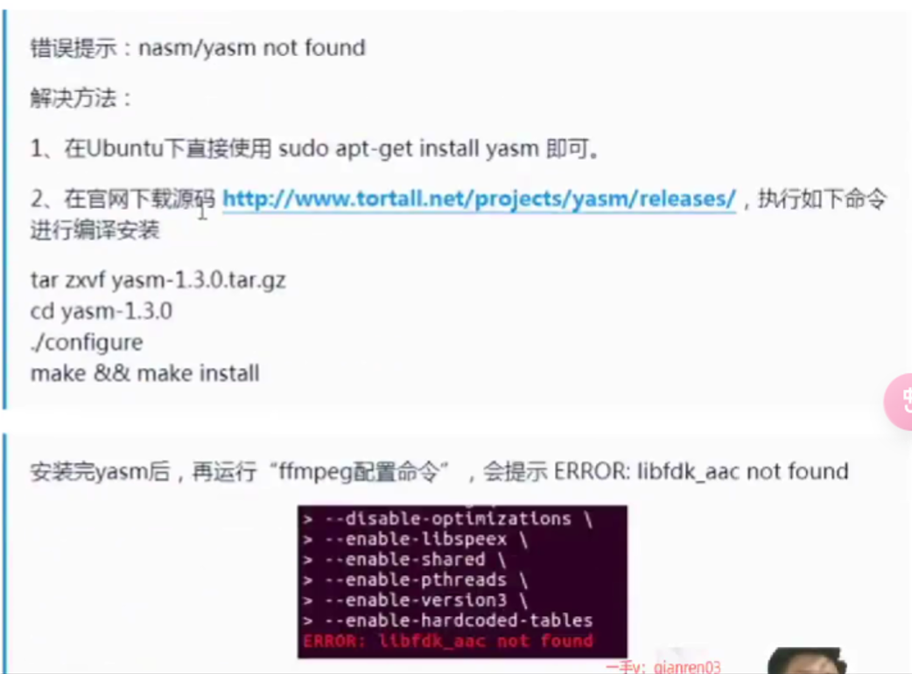
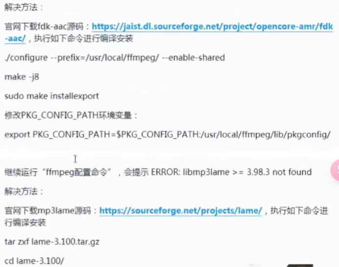


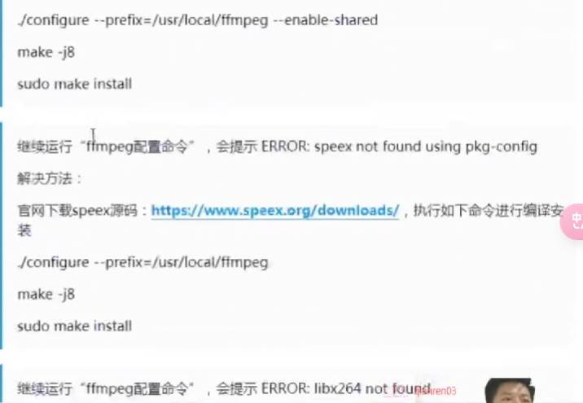


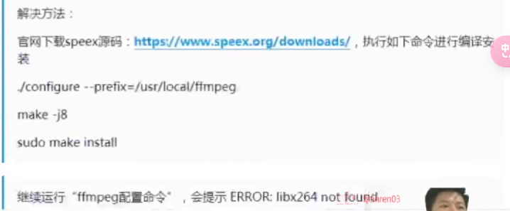

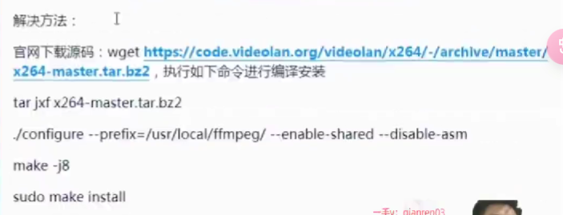


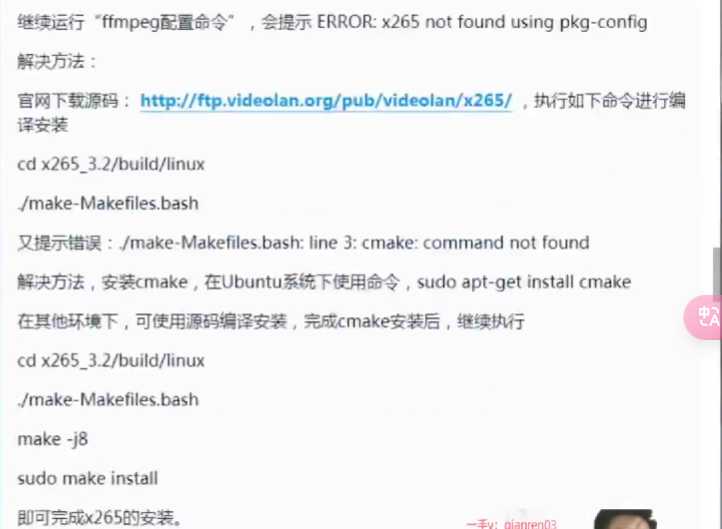

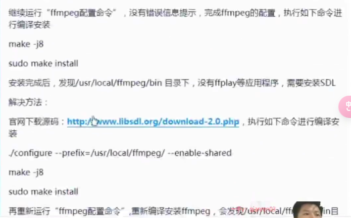


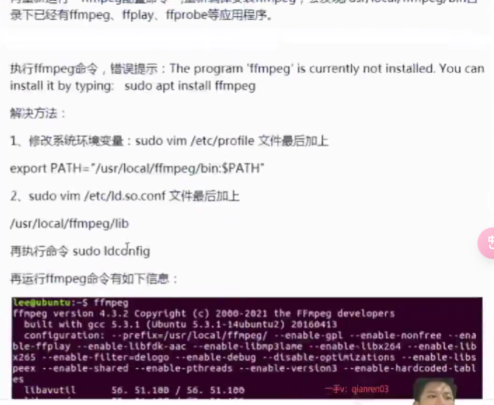


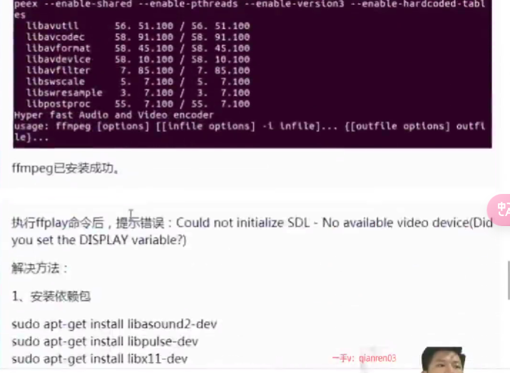


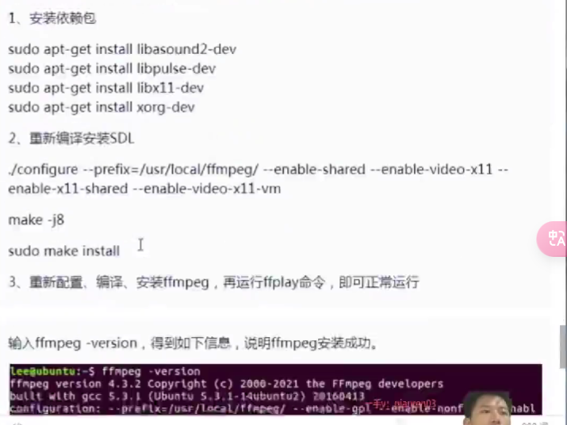


```c
sudo apt-get install libasound2-dev
sudo apt-get install libpulse-dev
sudo apt-get install libx11-dev
sudo apt-get install xorg-dev
```

```c
./configure --prefix=/usr/local/ffmpeg --enable-shared --enable-video-x11 --enable-x11-shared --enable-video-x11-vm
```

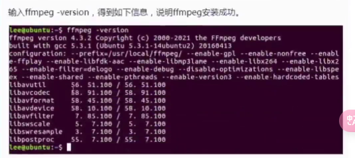


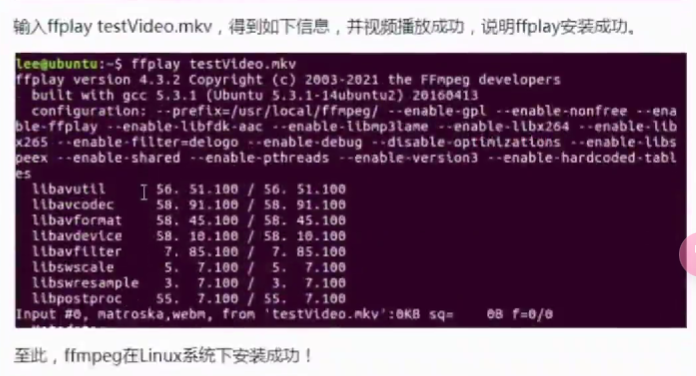


ffplay一直无法播放视频的话（因为我是用的wsl2），尝试在终端配置文件加上`SDL_RENDER_DRIVER=software`

在fish终端配置文件加
```c
set -x SDL_RENDER_DRIVER software
```