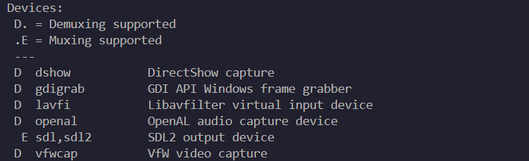

# 音视频采集
## 视频采集命令
- 查看设备列表：
```bash
ffmpeg -hide_banner -devices
```


- 查看dshow支持的参数：
```bash
ffmpeg -h demuxer=dshow
```

- 查看dshow支持的设备：
```bash
ffmpeg -f dshow -list_devices true -i dummy
```
一般是`Integrated Camera`，这是本地摄像头

- 采集摄像头画面：
```bash
ffmpeg -f dshow -i video="Integrated Camera" ./video/output.mp4
```

播放摄像头采集画面：
```bash
ffplay output.mp4
```

## 流程
| 函数名 | 描述 |
| --- | --- |
| `avdevice_register_all` | 注册所有可用的设备 |
| `avformat_alloc_context` | 分配格式上下文 |
| `av_dict_set` | 设置字典选项 |
| `av_find_input_format` | 查找输入格式 |
| `avformat_open_input` | 打开输入文件 |
| `avformat_find_stream_info` | 查找流信息 |
| `av_find_best_stream` | 查找最佳流 |
| `avcodec_alloc_context3` | 分配编解码器上下文 |
| `avcode_parameters_to_context` | 将参数复制到上下文 |
| `avcodec_find_decoder` | 查找解码器 |
| `avcodec_open2` | 打开编解码器 |
| `av_read_frame` | 读取帧 |
| `avcode_send_packet` | 发送数据包 |
| `avcodec_receive_frame` | 接收帧 |

颜色空间格式转换：
| 函数名 | 描述 |
|--|--|
| `sws_getContext` | 获取缩放上下文 |
| `av_frame_alloc` | 分配帧 |
| `av_image_get_buffer_size` | 获取图像缓冲区大小 |
| `av_malloc` | 分配内存 |
| `av_image_fill_arrays` | 填充图像数组 |
| `sws_scale` | 缩放图像 |

先用ffmpeg指令试一下视频采集格式，后续代码写的时候要用对应采集的格式。

# 音频采集
## 音频采集命令
- 查看设备列表：
