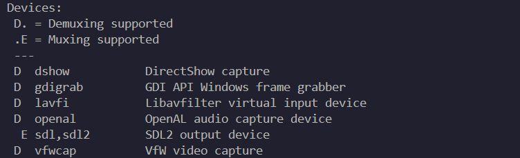

# 音视频采集
## 视频采集命令
- 查看设备列表：
```bash
ffmpeg -hide_banner -devices
```


- 查看dshow支持的参数：
```bash
ffmpeg -h demuxer=dshow
```

- 查看dshow支持的设备：
```bash
ffmpeg -f dshow -list_devices true -i dummy
```
一般是`Integrated Camera`，这是本地摄像头

- 采集摄像头画面：
```bash
ffmpeg -f dshow -i video="Integrated Camera" ./video/output.mp4
```

播放摄像头采集画面：
```bash
ffplay output.mp4
```
